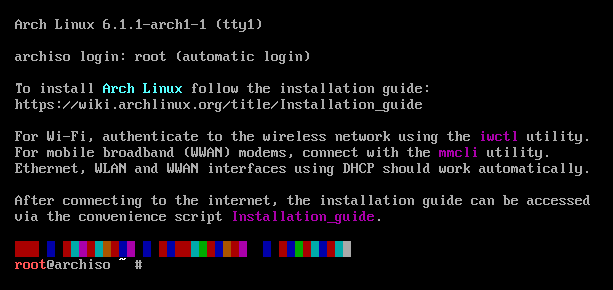
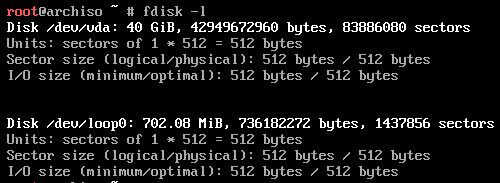
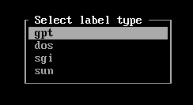
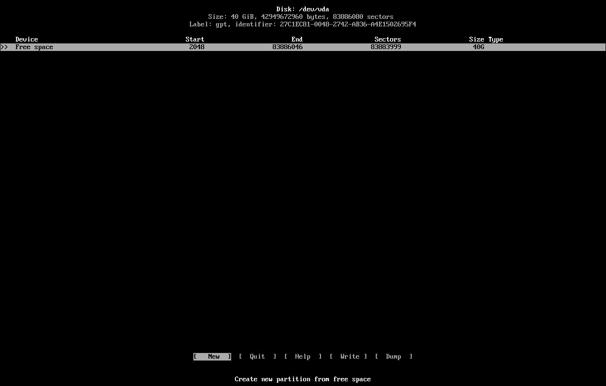
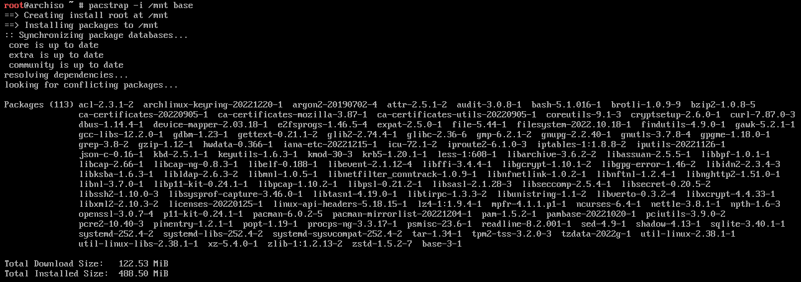
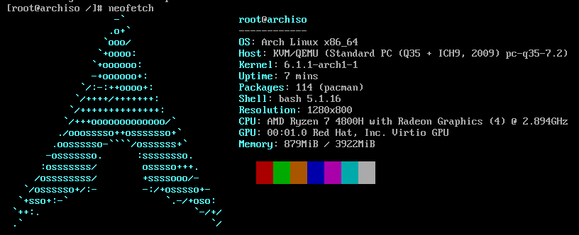
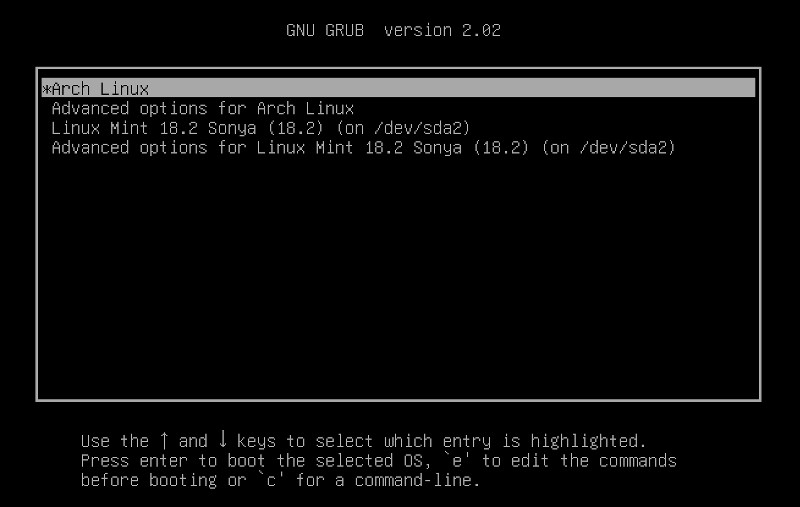

#  Arch GNU/Linux Installation

This is a beginner-friendly guide for a first arch linux installation.

## Download the ISO

Go to the [arch website](https://archlinux.org) under the download section, and you will find various mirrors to download the iso from.
Make sure to download the latest version (usually from the current month) as verify its signature.

```bash
gpg --keyserver-options auto-key-retrieve --verify archlinux-x86_64.iso.sig
```

Create a bootable usb using the iso you download. You can use a tool like [etcher](https://github.com/balena-io/etcher) or [rufus](https://rufus.ie/en/) to fulfill this job.

Once your usb stick is ready, boot on it.



*Live User Terminal after booting Arch GNU/Linux*

## Setup

As you can see, the Arch live user is a very minimalistic environment. It does not provide any GUI and send you straight to a tty console for you to install the system.

### Keyboard Layout

By default, the keyword layout is set to `Qwerty`, so you may need to change it.
Use the `loadkeys` command to rectify the keyboard layout if necessary.

*On Qwerty layout `a` is `q`*

```bash
loadkeys fr
```

### Wireless Network

It is recommended to use an ethernet connection for the installation process.
However, you may need to connect your computer to a wireless network.

In this case, use `iwd` to connect to your Wi-Fi. Start the CLI using the command `iwctl`.

> Scan networks
```bash
station wlan0 get-networks
```

> connect
```bash
station wlan0 connect [ssid]
```

### Refresh keys

Since most base packages use GPG keys to check the package authenticity, you may need to refresh your live-user keys depending on the date your created the bootable installation usb. 

If you encounter any problem while installing a package, due to an invalid or expired key, you can use the following command to make sure the keys are up-to-date. The command may take a few minute to retrieve the data.

```bash
pacman-key --refresh
pacman-key --populate
```

### Autocompletion

To speed up the installation proceed, you can try to install the `fish` shell for a better command autocompletion. The live user should have a bit a space left to allow the installation of this package. However, it will be reverted once you reboot.

```bash
pacman -Sy fish
```

## Setup the disks

### Finding the correct drive

> The command on the following steps will vary depending on the drive your compute has. Make sure to use the relevant name to avoid undesired results.

In order to know where you will install arch, you can run `lsblk` to list your get a list of your computer drives.


*On a virtual machine, the main drive might be call `vda`, while in a classic installation it could be either named `sda`, or `nvme` depending on your hardware configuration. If you have multiple drive, make sure to choose the right one.*

Alternatively, you can use the `fdisk -l` command for a similar purpose



*Results ending in `rom`, `loop` or `airoot` may be ignored.*

⚠ **Warning**
> for now on the drive will be referred as `$(drive)`, make sure to replace it with your correct drive name for each command!

### Partitioning

You can customize the drive(s) partitioning as much as you want. However, this is a basic partitioning example that can serve as a good base if you don't know what to do.

In this guid, I will use `cfdisk` to setup the disk partitions.

If you get this selection menu when opening `cfdisk`, it means that your drive didn't have any partition table system set before. This is often the case for new or virtual hardware. In  this case, you can select the `gpt` option.



If you have any partition, you may want to remove then. In a case where you are dual booting with another OS, make sure to delete the correct partition. This process can still be undone until the new partition table is written.



You will need to set at least 2 partitions, one for the EFI System, and the other one you the Linux Filesystem:

| Device    | Size  | Type             |
|:----------|:------|:-----------------|
| /dev/vda1 | 500M  | EFI System       |
| /dev/vda2 | 39.5G | Linux Filesystem |

Don't forget to set the partition type properly.

Additionally, you can create a partition for your future `home` folder. This may be useful if you are new to arch linux,  to keep your personal data aside if you break the system (which can easily happen on this distribution). 

| /dev/vda3 | 120G | Linux Filesystem |
|:----------|:-----|:-----------------|

You may also allocate a small partition for swap. Keep in mind that both are fully optional.

| /dev/vda4 | 8G  | Linux Filesystem |
|:----------|:----|:-----------------|

In order to confirm your changes, use iter `fdisk -l` or `lsblk`


For now own, l will refer to your root partition as `$(part2)`, and your EFI partition as `$(part1)`, make sure to translate it according to your setup.

#### Using fdisk instead of cfdisk

If you're using fdisk here is a small guide to help yoou setup the partition.
The following command details the process for the 2 first partitions.

> `/` represent default values.

| Command                 | Explanation                                                                      |
|:------------------------|:---------------------------------------------------------------------------------|
| g                       | Creating a new GTP disk label                                                    |
| n - `1` - `/` - `+500M` | Creating a 1st partition with a size of 500Mb                                    |
| t - `1`                 | Changing the partition type to EFI system                                        |
| n - `/` - `/` - `/`     | Creating a 2nd with the remaining space                                          |
| t - `/` - `20`          | Changing the partition type Linux Filesystem to add a virtual partitioning layer |
| w                       | Writing the change to the disk                                                   |

### Format

After this point, consider that any data left on the device you will be formatting tol be gone forever.

> Format the EFI partition
```
mkfs.fat -F32 /dev/$(part1)
```

> Format the root partition
```
mkfs.ext4 /dev/$(part2)
```

If you have other partitions you likely want to use `ext4` as the format type.

## Installing Arch

The disks are now set to install the system. The installation proceed takes place from the live user, through the mount point folder.

### Mount the partitions

Mount all non-EFI partitions according to the place they will take.

```
mount /dev/$(part2)
```

> Using `lsblk` you can check which partitions are being mounted and where.


For instance, if you have a partition for your home folder, you may use the following commands.

```
mkdir -p /mnt/home
mount /dev/$(partX) /mnt/home
```

The EFI partition 

### Download the system base

This command will download the core arch packages and add them into the mounted system to make it functional.

```
pacstrap -i /mnt base
```


### Generate fstab

To make sure the partition are mounted properly when you will boot your system, linux use a configuration file located in `/etc/fstab`. This is the first configuration file to generate in order to keep the partition layout later on.

```
genfstab -U -p /mnt >> /mnt/etc/fstab
```


### Arch Chroot

Using the `arch-chroot` command, it is possible to set the current root the mounted system such that every action will take place inside it.

```
arch-chroot /mnt
```


> `neofetch` is not installed by default use `pacman -Sy neofetch` to install it.



## System Installation

### Linux Kernel

Currently, the mounted system doesn't have any proper kernel. In its current state, it would be possible to access it other than using chroot.

Multiple kernel can be installed, `linux` being the more widely used. You could also add `linux-lts` for long term support. 

```bash
pacman -Sy linux linux-headers
```

Alternatively,

```bash
pacman -Sy linux-lts linux-lts-headers
```

Along the kernel, install the [`base-devel`](https://archlinux.org/groups/x86_64/base-devel/) package to get commons utilities such as `sudo`, `gcc`, `make`, `pacman` and more.

### Networking

The following packages will allow to you the network within the system that is being installed.

```
pacman -S networkmanager wpa_supplicant wireless_tools netctl dialog
```

Many firmware images are provided by the `linux-firmware` package

```
pacman -S linux-firmware
```

However, some hardware will require specific drivers to be installed in order to fully work.
You can check for the list [here](https://wireless.wiki.kernel.org/en/users/drivers).

Now, make the network manager service start automatically.

```
systemctl enable NetworkManager
```

## Configuration

You will need to install a text editor to configure settings such as [vim](https://www.vim.org/) or [nano](https://www.nano-editor.org/) which are both available in the pacman repository list.

### locale

To set the system language edit the `locale.gen` file and uncomment the locale you want to use. It should preferably be in `utf-8`.

```
nano /etc/locale.gen
```


Now generate the local for that language

```
locale-gen
```


#### Keybinding

Edit the `/etc/vconsole.conf` file to set your terminal keyboard layout

```
KEYMAP=fr
```

### Account

For security reasons, it is adivsed to set a strong password for your root account.

```
passwd
```

Then add a regular user that will be the default user.
Set the `$(username)` accordingly.

```
useradd -m -g users -G wheel $(username)
```

And add a password for this user too.

```
passwd $(username)
```

The user is part of the `wheel` group. This group is meant to enable `sudo` access from a regular user. To enable it, modify use the following command.

```
EDITOR=nano visudo
```

and uncomment the following line
```
%wheel ALL=(ALL:ALL) ALL
```

> If you uncomment the `%wheel ALL=(ALL:ALL) NOPASSWD: ALL`, the user will be able to use root privilege without any password. This is often a bad practice as it is a huge security risk.

## Grub

> Grub is a very popular bootloader among linux system.
> It will allow to boot on the installed system. I can also be helpful for multi-boot.



We will assume your system is using `UEFI` mode. If you get an error, you may be on a `i386pc` system.

Install grub among other tooling that we will use to setup it.

```bash
pacman -S grub dosfstools efibootmgr os-prober mtools
```

In order to add make grub functional, the `EFI` partition needs to be mounted.

```
mkdir /boot/EFI
mount /dev/$(part1)$ /boot/EFI
```

Grub can now be installed.

```
grub-install --target=x86_64-efi --bootloader-id=grub_uefi --recheck
```

By default, grub config is not shipped, so it needs to be added. 
This will register your kernel to the grub menu.

```
grub-mkconfig -o /boot/grub/grub.cfg
```

> From this point, the system is considered as installed. If you reboot, you can use it independently of the usb installation device.


Copy the translation line for grub

```
cp /usr/share/locale/en\@quot/LC_MESSAGES/grub.mo /boot/grub/locale/en.mo
```

### Swap

#### Using a file

If you want to use a file for your swap, you can create one using the following commands where `$(size)` is the swapfile size in `mb`.

```bash
dd if=/dev/zero of=/swapfile bs=1M count=$(size) status=progress
chmod 600 /swapfile
```
This will create a file filled with `0` .

Now configure your `swapfile`

```
mkswap /swapfile
echo '/swapfile none swap 0 0' | tee -a /etc/fstab
```

The second command make sure that the swap will be recognized when mounting the system.

#### Using a partition

You can configure the swap using the follow command where `$(part_swap)` refers to your swa partition.

```
mkswap /dev/$(part_swap)
```

#### Nspawn

From now own, we will run the Operating system in a light way container. It allows to properly emulate system services unlike chroot.

Exit chroot before using nspawn

```
exit
```

```
systemd-nspawn -bD /mnt
```

Then login using your regular user.

### Hostname

Set your computer hostname using the `hostnamectl` command.

```
hostnamectl set-hostname $(name)
```

### Time sync

Syncing the time is very important to communicate to internet properly. Set your timezone according to the nearest city.

```bash
sudo timedatectl set-timezone Europe/Paris
```

Enable the automatic sync daemon

```
sudo systemctl enable systemd-timesyncd
```

### Other tweak

#### hosts file

Add `localhost` definition to your `hosts` file

```
echo '127.0.0.1 localhost' | sudo tee -a /etc/hosts
```

#### Micro code

The cpu ucode provide stability and security updates for the cpu.


> With an `amd` CPU
```
sudo pacman -Sy amd_ucode
```

> With an `intel` CPU
```
sudo pacman -Sy intel_ucode
```

## Desktop Environment

#### Xorg

You need to install `xorg` to be able to start a graphical user interface.

```
sudo pacamn -S xorg xorg-server
```

Along this, you need to install a video driver for your gpu

```
sudo pacman -S mesa
```

if you have an nvidia card, install the corresponding driver.

```bash
sudo pacman -S nvidia
```

> For the `lts` kernel, user `nvidia-lts` instead.

#### Plasma

This Desktop environment is very user-friendly yet very powerful and configurable. It is a good desktop environment for a new or casual user.

Install the desktop environment

```
sudo pacman -S plasma-desktop plasma-meta
```

Add the kde file manager and archive extractor

```
sudo pacman -S ark dolphin
```

#### Qtile

This Desktop environment is very light compare to kde but will need more configuration from the user part. It is fully customizable through a configuration written in python.

```
sudo pacman -S qtile
```

## Display manager

Install a display manager to login yourself at system startup and start the desktop environment.

> It is possible to not use a display manager and login on the tty. For this you will need to setup a `.xinitrc` config and install `xorg-xinit`fig and install `xorg-xinit`.

```
sudo pacman -S sddm
```

Enable the display manager

```
sudo systemctl enable sddm
```

## Epitech

If you are an Epitech student you may consider adding these packages to get the needed C libraries and the coding style checker.

```
sudo pacman -S csfml criterion ncurses docker emacs-nox
```

The docker service need to be started with the system.

```
sudo systemctl enable docker
```

